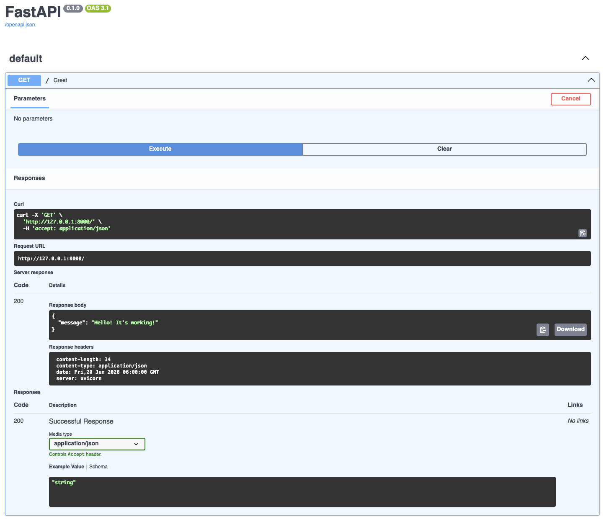
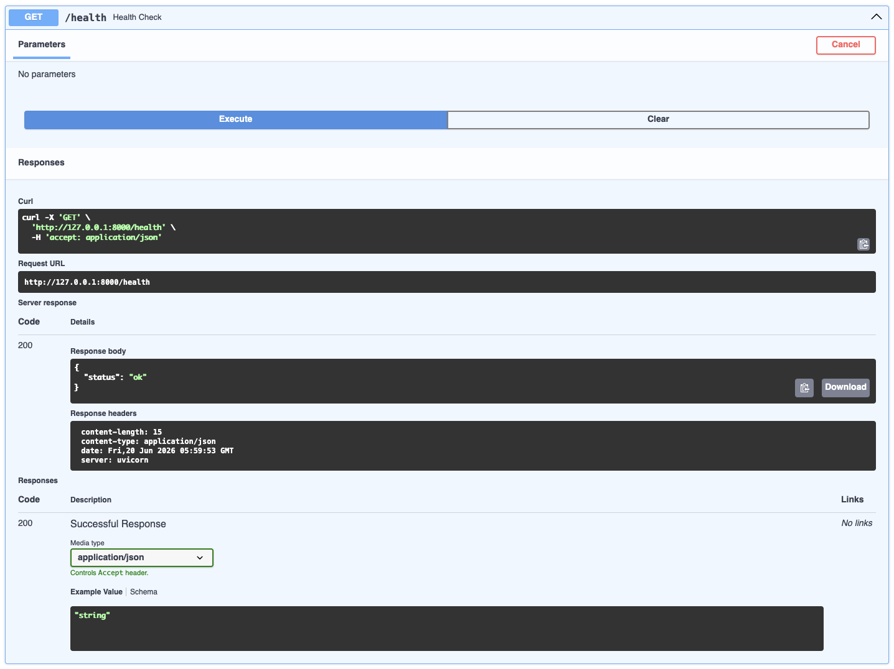
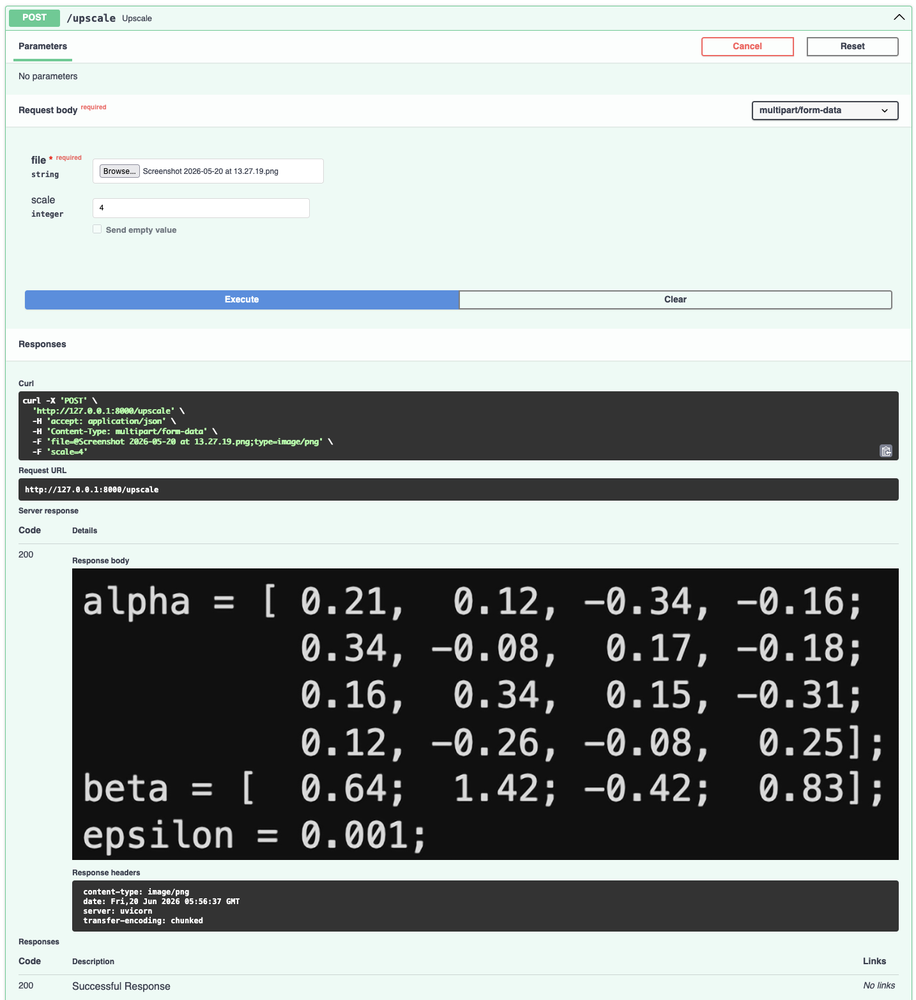
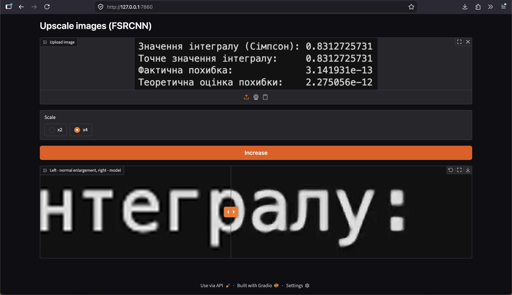
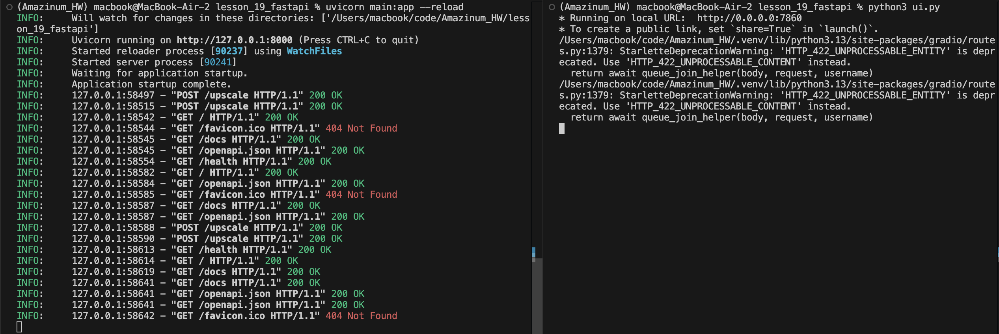

# Image Upscaling API (FSRCNN)

A service for increasing image resolution using the FSRCNN super-resolution
CNN model. Consists of a REST API built with **FastAPI** and a simple
**Gradio** web interface with a before/after comparison slider.

## Overview

The user uploads an image and selects a scale factor (×2 or ×4). The service
runs it through the FSRCNN model and returns the upscaled image. The web
interface displays the result via a slider: left — standard stretching
(bicubic), right — model output.

## Architecture

Single request flow:

```
Client (browser / Gradio)
        |  POST /upscale  (file + scale)
        v
FastAPI + uvicorn        <- accepts request, provides UploadFile
        |
        v
ml.upscale_image()       <- decoding -> FSRCNN -> encoding
        |
        v
StreamingResponse        <- returns PNG
```

Layers are separated: `ui.py` knows nothing about the model (sends bytes to
the API), `ml.py` knows nothing about FastAPI (works only with bytes).

## Modeling

- Model: **FSRCNN** (Fast Super-Resolution CNN) via `cv2.dnn_superres` from OpenCV.
- Weights: `FSRCNN_x2.pb` (~38 KB) and `FSRCNN_x4.pb` (~41 KB) — stored in the repository.
- Runs on CPU, no GPU or torch required. Both models are loaded once at startup.

## Installation

Locally:

```bash
pip install -r requirements.txt

# terminal 1 — backend
uvicorn main:app --reload

# terminal 2 — frontend
python ui.py
```

API: <http://127.0.0.1:8000> (Swagger — `/docs`).
UI: <http://127.0.0.1:7860>.

Via Docker:

```bash
docker compose up --build
```

Starts both services: `api` (8000) and `ui` (7860).

## Interface

### REST API

| Method | Path        | Input                                    | Output              |
|--------|-------------|------------------------------------------|---------------------|
| GET    | `/`         | —                                        | JSON `{"message"}`  |
| GET    | `/health`   | —                                        | JSON `{"status": "ok"}` |
| POST   | `/upscale`  | `file` (image) + `scale` (2 or 4)        | PNG (image/png)     |

Errors: invalid file or `scale` ∉ {2,4} → `400 Bad Request` with explanation.

### Web UI (Gradio)

Upload image → select scale (×2 / ×4) → click "Increase" →
`ImageSlider` comparing bicubic vs model output.

## Results

### Swagger UI — `GET /`


### Swagger UI — `GET /health`


### Swagger UI — `POST /upscale` (×4)


### Gradio UI — bicubic vs FSRCNN comparison (×4)


### Server Logs


## Project structure

```
lesson_19_fastapi/
├── main.py  # FastAPI: endpoints
├── ml.py    # ML layer: bytes -> FSRCNN -> bytes
├── ui.py    # Gradio UI, sends requests to API
├── requirements.txt
├── dockerfile
├── docker-compose.yml
├── .env.example
├── FSRCNN_x2.pb
└── FSRCNN_x4.pb 
```