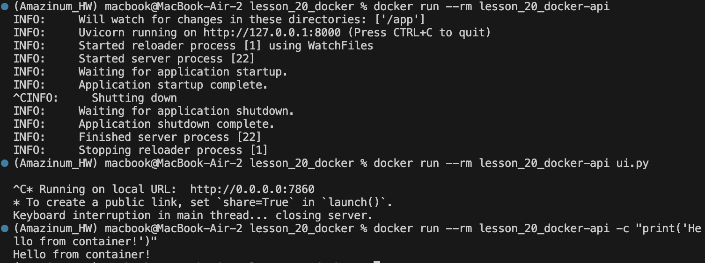
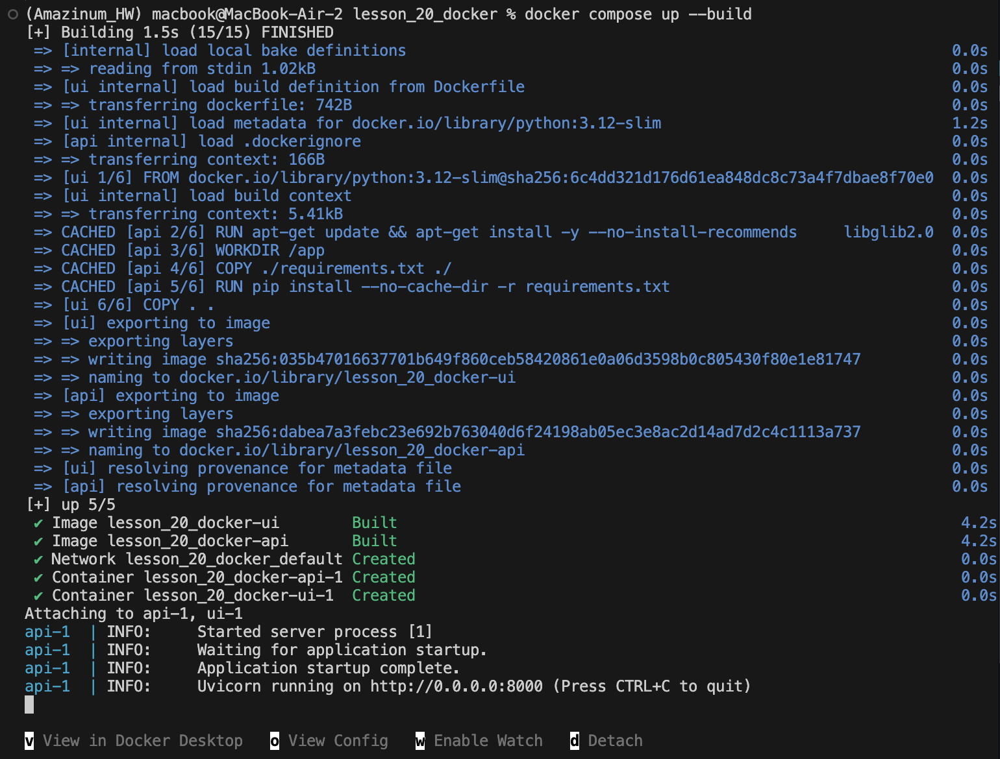
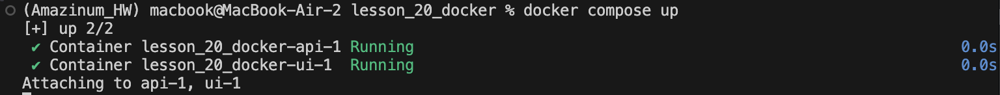
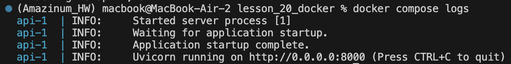
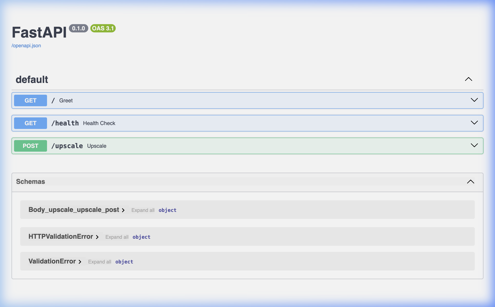
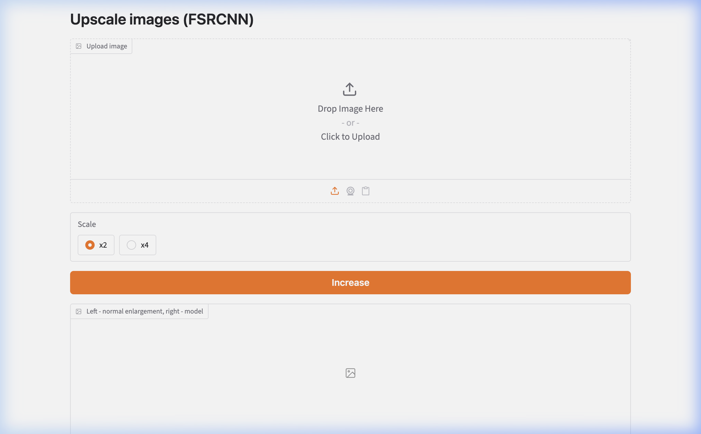

# Lesson 20 — Docker Deployment

Docker deployment of the **Image Upscaling API (FSRCNN)** from Lesson 19.
The project consists of a **FastAPI** backend and a **Gradio** web UI,
packaged as Docker containers using `docker compose`.

## Base Project

This is a Docker deployment of [lesson_19_fastapi](../lesson_19_fastapi/) — a WebAPI
that upscales images using the FSRCNN super-resolution model (×2 / ×4).

---

## Dockerfile


### Commands used in Dockerfile

| Instruction | Purpose |
|-------------|---------|
| `FROM python:3.12-slim` | Base image — lightweight Python 3.12 on Debian |
| `RUN apt-get update && apt-get install -y ...` | Install system dependency (`libglib2.0-0`) required by OpenCV |
| `WORKDIR /app` | Set the working directory inside the container |
| `COPY ./requirements.txt ./` | Copy only requirements first (for Docker layer caching) |
| `RUN pip install --no-cache-dir -r requirements.txt` | Install Python dependencies without caching pip packages |
| `COPY . .` | Copy the rest of the application code |
| `EXPOSE 8000 7860` | Document the ports used by the API and UI |
| `ENTRYPOINT ["python"]` | Fix the interpreter — every `docker run` executes `python <args>` |
| `CMD ["main.py"]` | Default script to run if no arguments are provided |

### ENTRYPOINT + CMD pattern

The key requirement of this homework is to allow running **any script**
inside the container by providing arguments to `docker run`:

```dockerfile
ENTRYPOINT ["python"]   # always runs python
CMD ["main.py"]         # default argument (overridable)
```

This means:

```bash
# Run the default (main.py — starts the API server)
docker run <image>

# Run a different script (ui.py — starts the Gradio UI)
docker run <image> ui.py

# Run inline Python code
docker run <image> -c "print('Hello from container!')"
```



---

## docker-compose.yml

```yaml
services:
  api:
    build: .
    command: ["-m", "uvicorn", "main:app", "--host", "0.0.0.0", "--port", "8000"]
    ports:
      - "8000:8000"

  ui:
    build: .
    command: ["ui.py"]
    environment:
      - API_URL=http://api:8000
    ports:
      - "7860:7860"
    depends_on:
      - api
```

| Key | Meaning |
|-----|---------|
| `build: .` | Build image from the Dockerfile in current directory |
| `command: ["-m", "uvicorn", ...]` | Overrides `CMD` — runs `python -m uvicorn main:app ...` |
| `command: ["ui.py"]` | Overrides `CMD` — runs `python ui.py` |
| `ports: "8000:8000"` | Map container port 8000 to host port 8000 |
| `environment: API_URL=http://api:8000` | Tell the UI where the API is (Docker internal network) |
| `depends_on: - api` | Start `api` container before `ui` |

---

## Docker Commands Used

### Build and start both services

```bash
docker compose up --build
```

Builds images from the Dockerfile and starts both containers (`api` + `ui`).



### Check running containers

```bash
docker compose ps
```



### View container logs

```bash
docker compose logs
```



### Stop and remove containers

```bash
docker compose down
```

### Run a one-off command in the container

```bash
# Default — starts the API
docker run --rm lesson_20_docker-api

# Run a specific script
docker run --rm lesson_20_docker-api ui.py

# Run inline Python
docker run --rm lesson_20_docker-api -c "print('Hello from container!')"
```

---

## Running Application — Screenshots

### Swagger UI (API docs) — `http://localhost:8000/docs`



### Gradio Web UI — `http://localhost:7860`



---

## REST API Endpoints

| Method | Path        | Input                                    | Output              |
|--------|-------------|------------------------------------------|---------------------|
| GET    | `/`         | —                                        | JSON `{"message"}`  |
| GET    | `/health`   | —                                        | JSON `{"status": "ok"}` |
| POST   | `/upscale`  | `file` (image) + `scale` (2 or 4)        | PNG (image/png)     |

---

## Project Structure

```
lesson_20_docker/
├── Dockerfile           # Multi-purpose image (ENTRYPOINT + CMD)
├── docker-compose.yml   # Orchestrates api + ui services
├── main.py              # FastAPI: REST endpoints
├── ml.py                # ML layer: bytes → FSRCNN → bytes
├── ui.py                # Gradio UI, sends requests to API
├── requirements.txt     # Python dependencies
├── .dockerignore        # Files excluded from Docker build context
├── .env.example         # Environment variable template
├── FSRCNN_x2.pb         # Model weights (×2)
├── FSRCNN_x4.pb         # Model weights (×4)
└── results/             # Screenshots for README
```